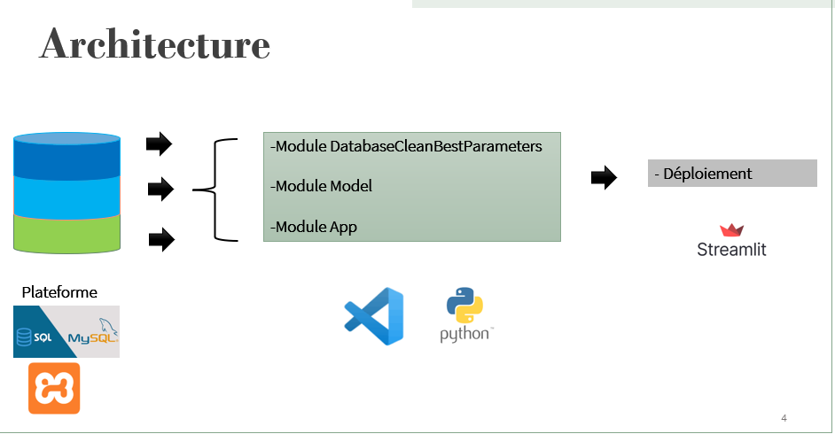

# MyGeeks

# Estimation du coût énergétique des entreprises 

Ce readme explique la procédure à suivre pour prédire et calculer le coût énergétique des entreprises à partir d'une description textuelle.

Installation

Pour bien démarrer, créer un environment virtuelle pour installer les dépendances.

``` python -m venv MyEnvi ```

Une fois l'environnement créé, procédez à l'installation des dépendances.

``` python install -r requirements.txt ```


## Installer MySQL Workbench

### Téléchargement

Pour installer MySQL Workbench, vous devez d'abord le télécharger depuis le site officiel de MySQL :

[Lien vers MySQL Workbench](https://dev.mysql.com/get/Downloads/MySQL-Workbench/8.0.28/mysql-workbench-community-8.0.28-winx64.msi)

Choisissez la version qui correspond à votre système d'exploitation.

### Installation

Une fois le fichier d'installation téléchargé, lancez-le et suivez les instructions à l'écran.

L'installation est généralement simple et ne devrait pas poser de problème.
Une fois l'installation terminer cree une base de données nommé **platform** et exporter les fichiers d'extension .sql

Ensuite suivez la procedure de l'architecture 




## Étapes pour exécuter le code

Les étapes de ce code sont simples et compréhensibles :

1. **Étape 1 - Chargement des données :** Utilisez le module [DatabaseCleanBestParameters](https://github.com/TatangF/BattleIAPau_2024/blob/main/DatabaseCleanBestParameters.py) pour importer les données depuis une base de données ou un entrepôt de données nommé "platform".

2. **Étape 2 - Entraînement du modèle :** Utilisez le module [model.py](https://github.com/TatangF/BattleIAPau_2024/blob/main/model.py) pour entraîner les données si vous en avez plus disponibles. Enregistrez ensuite votre modèle ainsi que le vecteuriseur (TF-IDF).

3. **Étape 3 - Lancement de l'application :** Utilisez le module [app.py](https://github.com/TatangF/BattleIAPau_2024/blob/main/App.py) pour lancer votre application. Vous pourriez entrer une description ou un fichier contenant des descriptions, puis l'application prédira le code identifiant et le coût énergétique associé.
